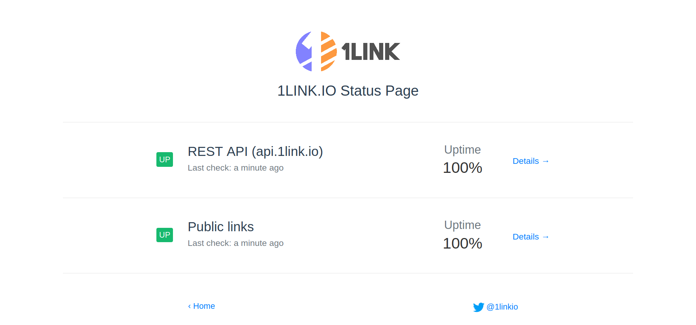

# Updown Status Page

Free status page to list all your updown.io checks

Example:
[](https://status.1link.io/)


## How it works

Fetches updown.io's API via the read only key and populates the page, hosting is provided by Netlify (free).
Page is written in Vue.js.

## Deploy your own public page

 * [](https://app.netlify.com/start/deploy?repository=https://github.com/nya1/updown-status-page)
 
   * This will automatically create your own updown-status-page repository and setup netlify build commands

 * Go to your repository and edit `page_config.json` with your details (read only key, website url, logo url etc.)

Every Github commit will trigger a new deploy of your status page


## Build Setup (only for development)

<p align="center">
  
</p>

``` bash
# install dependencies
yarn install

# serve with hot reload at localhost:8080
yarn dev

# check vue and js syntax
yarn lint

# build for production with minification
yarn build

# build for production and view the bundle analyzer report
yarn build --report
```
